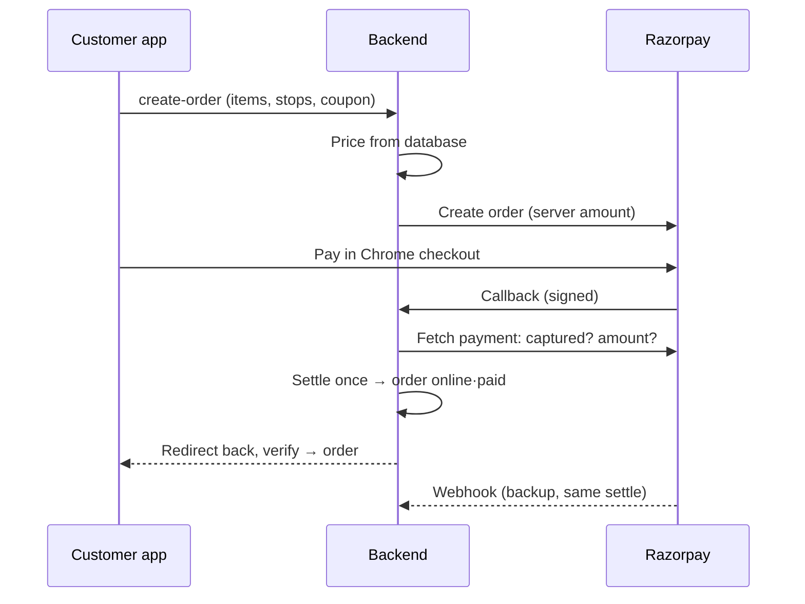

# Razorpay Integration Report: Flavour

**Date:** 25 Sep 2026 · **Branch:** `dev` (uncommitted) · **Design reference:** `RAZORPAY_INTEGRATION.md`

This covers what was built for customer payments, cash, refunds and driver/vendor payouts across the backend, customer app, driver app and admin panel: how it works, how it is secured and tested, and what remains before real money.

---

## 1. Status at a glance

| | Status | Detail |
|---|---|---|
| ✅ | **Works in test mode** | A real Razorpay test-mode order (F250926816561, ₹349) was paid, cancelled and refunded automatically. |
| ✅ | **Secured in code** | Server-side pricing, payment verification and access control. 50 automated scenario checks pass (stubbed Razorpay, not a live penetration test). |
| ⚠️ | **Payouts are manual for now** | RazorpayX isn't set up. Admin pays drivers/vendors by bank/UPI and records the UTR in the admin panel. |
| ❌ | **Not ready for live money yet** | 7 go-live items remain (see §10). |

> Nothing is committed yet. All changes are in the working tree on `dev`. The backend, customer app and driver app type-check; the admin panel builds; lint shows no new errors.

---

## 2. Scope

| Area | Delivered |
|---|---|
| **Customer app** | Cash / Online choice on food, meat and ₹149 store checkout, package delivery, rides (now and scheduled) and helper tasks. Razorpay opens in Chrome (Custom Tab). Refund status shown on cancelled orders in My orders. |
| **Driver app** | "Paid online" or "Cash to collect ₹X" on every job. "Confirm cash collected" step before completing a cash job. Earnings account for cash in hand. Truthful cash-out messages. `9999` master code removed. |
| **Backend** | Server-side pricing, Razorpay checkout and settlement, payments webhook, automatic Razorpay refunds, cash-collection API, cash-aware driver balance, RazorpayX client (unused until configured), vendor payout balance, access-control fixes on orders and sockets. |
| **Admin panel** | New **Refunds** page (monitor, retry, record manual refunds) and **Payouts** page (bank details, Mark paid with UTR, Reject). Payment column in the driver trips table. |
| **Not in scope** | Partner website (no payments), chargebacks, settlement reconciliation, GST credit notes, cancellation fees. |

---

## 3. How it works

### 3.1 Online payment (all services)

1. The customer picks **Online** and taps Pay. The app sends *what* is being bought: items, stops, coupon, tier, helper offer.
2. **`POST /payments/create-order`**: the server calculates the price.
   - Food, meat and store: re-priced from the live menu, with the vendor's delivery fee and a server-checked coupon. If a price changed, it returns `PRICES_CHANGED` and charges nothing.
   - Rides and packages: the same fare function cash orders use.
   - It then creates the Razorpay order and a `Payment` record (user, amount, server-priced order data).
3. The app opens a server-hosted checkout page in Chrome, reached through a signed link valid for 30 minutes. The customer pays on Razorpay's page; the app never handles card or UPI details.
4. Razorpay posts the result to **`/payments/checkout/callback`**. The server checks the HMAC signature, then asks Razorpay whether the payment was captured and whether the amount, currency and order match.
5. One settlement routine creates the order **exactly once**, as `online · paid`, using a lease, unique indexes and an order↔payment link. The callback, the app's `/payments/verify` call and the webhook all use it, and all are safe to repeat.
6. Chrome returns to `flavour://payment-result` and the app continues to "finding driver" or tracking. If Chrome was closed or the app was killed, the order is still created, and the app recovers it.

### 3.2 Cash

1. The order is placed immediately as `cash · pending` through `POST /orders`, which only accepts cash.
2. The driver sees "Cash to collect ₹X". At the final stage, they enter the amount and tap Confirm.
3. **`POST /orders/:id/cash-collected`** checks that the caller is the assigned driver, that the order is a cash order and still active, and that the amount equals the order total. It records `cash_collected` with the time, amount and driver, and notifies the customer. "Delivered" is blocked until this is done.
4. Driver balance = 80% share − cash already in hand − payouts. The 80% rule is unchanged. A cash order reduces the balance by the platform's 20% instead of adding 80% again.

### 3.3 Cancellation and refund

- An online order that is cancelled (by the customer, the driver, or a restaurant rejecting a scheduled order) triggers an automatic **full Razorpay refund** to the original payment method. An atomic claim guarantees one refund per order.
- Refund states: `not_requested → pending → processed | failed`. It becomes `processed` only from Razorpay's own answer (the API response, the webhook, or a re-fetch).
- Cash orders never call Razorpay.
- The customer sees the refund line on the cancelled order in My orders (English, Telugu, Hindi).
- Admin **Refunds** page:
  - **Needs attention:** failed or not started.
  - **With Razorpay:** in progress.
  - **Refunded:** completed.
  - Actions: *Refund via Razorpay* (retry), *Check status*, *Mark refunded* with a UPI/bank reference. Marking refunded is blocked while a Razorpay refund is in progress.
- Refunds need normal Razorpay only, **not RazorpayX**. Razorpay's fee (~2%) is not returned on refunds. Live refunds come out of the Razorpay balance, so keep enough to cover them.

### 3.4 Driver and vendor payouts (manual until RazorpayX)

- **Driver cash-out:** password, a per-driver lock, a balance check, then a `pending` request that reserves the amount.
- **Vendor payouts:** capped at their share (items − `commissionRate`) of delivered, paid, unrefunded orders.
- **Admin Payouts page:** shows each request with account holder, account number and IFSC (with copy buttons). The admin transfers the money, then either clicks **Mark paid** with the UTR, or **Reject** with a reason (the amount returns to the balance). The payee is notified either way.
- **When RazorpayX is configured:** new requests go to RazorpayX automatically, with `reference_id` and an idempotency header. The status only moves on RazorpayX's answer: webhook or refresh.

---

## 4. Components

| Component | File | Role |
|---|---|---|
| Pricing | `backend/src/modules/payments/payment.pricing.ts` | Server price for online checkout |
| Checkout & settlement | `payments/payment.checkout.service.ts` | Razorpay order, settle-once, webhook handler |
| Hosted checkout page | `payments/payment.checkout.page.ts` | Server-rendered page running `checkout.js` (redirect mode), en/te/hi |
| Payment routes | `payments/payment.routes.ts` | create-order, checkout, callback, status, verify, webhook |
| Refunds | `payments/refund.service.ts` | Automatic refund, refund webhook, refresh, retry, manual record |
| Admin refunds & payouts | `payments/admin.money.service.ts`, `admin.money.routes.ts` | Lists and admin actions |
| RazorpayX | `payments/razorpayx.client.ts`, `payout.status.ts`, `payout.webhook.ts` | Direct HTTP client (the SDK has no payouts), forward-only status, webhook |
| Orders | `modules/orders/orders.service.ts` / `controller` / `routes` | `priceOrder`, cash collection, refund on cancel, access checks |
| Customer app helper | `app/utils/razorpay.ts` | `payOnlineAndPlaceOrder()`, Chrome checkout, confirm retries |
| Payment choice | `app/components/shared/PaymentMethodSelector.tsx`, `app/contexts/paymentMethodStore.ts` | Cash / Online per flow |
| Driver cash step | `driver/features/jobs/components/order/CashCollectionPanel.tsx` | Paid-online / cash-to-collect / confirm |
| Admin pages | `admin/src/pages/Refunds.tsx`, `Payouts.tsx`, `features/money/` | Refund and payout operations |

---

## 5. Data model changes

| Model | Fields |
|---|---|
| **`Payment`** (new) | `user`, `amount` (paise), `razorpayOrderId` (unique), `razorpayPaymentId` (unique), `orderData` (server-priced), `order`, `status` created \| processing \| captured \| flagged, `lockExpiresAt`, `returnUrl`, `language` |
| **`Order`** | `paymentMethod` cash \| online · `paymentStatus` pending \| paid \| cash_collected · `payment` · `cashCollected`, `cashCollectedAt`, `cashCollectedAmount`, `cashCollectedBy` · `refundStatus` not_requested \| pending \| processed \| failed, `razorpayRefundId`, `refundAmount`, `refundRequestedAt`, `refundCompletedAt`, `refundFailureReason`, `refundMethod`, `refundReference`, `refundedBy`, `refundNote` |
| **`DriverPayout`, `VendorPayout`** | Existing status: pending (requested) \| processing \| processed \| failed. Added: `processedAt`, `utr`, `method` razorpayx \| manual, `handledBy`, `adminNote` |
| **`Driver`, `Vendor`** | `payoutLockUntil` (one cash-out at a time) |

No migration was run. New fields have defaults. Orders created before this work have no stored payment method and are treated conservatively (see §11).

---

## 6. API

| Endpoint | Who | Purpose |
|---|---|---|
| `POST /payments/create-order` | Customer | Price on server, create Razorpay order, return checkout link |
| `GET /payments/checkout/:id?t=` | Signed link | Hosted checkout page |
| `POST /payments/checkout/callback` | Razorpay | Signed result → settle → back to app |
| `POST /payments/verify` | Customer (owner) | Confirm and return the order (idempotent) |
| `GET /payments/checkout-status/:rzpOrderId` | Customer (owner) | Did money arrive after the browser closed? |
| `POST /payments/webhook` | Razorpay (HMAC) | payment.captured / order.paid / refund.* |
| `POST /orders` | Customer | Cash orders only |
| `POST /orders/:id/cash-collected` | Assigned driver | Record cash |
| `GET /admin/refunds`, `POST /admin/refunds/:orderId/{refresh\|retry\|mark-refunded}` | Admin | Refund operations |
| `GET /admin/payouts`, `POST /admin/payouts/:kind/:id/{mark-paid\|reject}` | Admin | Manual payouts |
| `POST /payouts/webhook` | RazorpayX (HMAC) | Payout status (when configured) |

---

## 7. Security

### 7.1 Controls in place

- **Server decides the amount.** A tampered app can't pay ₹1 for a ₹345 order: the charge comes from the server quote, and a changed item price is refused before charging.
- **Payment proof comes from Razorpay:** a constant-time HMAC signature check plus a direct fetch of the payment (captured, amount, currency, order id). The old `sig_` test bypass is removed.
- **Exactly-once effects:**
  - unique Razorpay ids;
  - a settlement lease;
  - an order↔payment link;
  - conditional updates for cash, refunds and payouts;
  - locks on cash-outs and vendor payouts.
- **Secrets are backend-only.** The apps get only the public key id, on the hosted page. `.env` is git-ignored, and no secret was found in git history.
- **Webhooks:** the raw body is verified with each endpoint's own secret. Payments and payouts use separate secrets.
- **Rate limits** on payment endpoints: create 10/min, verify 20/min, status 60/min.

### 7.2 Vulnerabilities found and fixed

| Issue | Fix |
|---|---|
| Fake `sig_…` signature accepted unless `NODE_ENV=production` | Bypass removed |
| One valid payment could be replayed to create unlimited orders | Payment bound to user; settle-once |
| App decided the online amount | Server pricing |
| `GET /orders/vendor/:vendorId` needed no login: customer phones, addresses and OTPs were exposed | Login + owner or admin |
| `PATCH /orders/:id/status`: anyone could change or cancel any order | Role- and ownership-checked transitions |
| `GET /orders/:id`, invoice: anyone could read any order (including the delivery OTP) | Owner, assigned driver, vendor or staff only |
| Scheduled-delivery respond trusted the vendor id in the request body | Vendor id taken from the token |
| Vendor payouts had no balance check | Capped at earned share, with a lock |
| Master pickup code `9999` | Removed (backend and driver app) |
| Sockets: any user could join or spoof any order's live room and chat | Order-party check on every order event |
| Fake payouts shown as "processed"; driver double-paid on cash orders | Truthful states; cash-aware balance |

> These results come from code review and automated scenario tests, not from an external penetration test. Before launch, an independent review of the live server is recommended.

---

## 8. Testing

| What | How | Result |
|---|---|---|
| End-to-end online payment and refund | Real Razorpay **test mode**, customer app on a phone | ✅ ₹349 paid → order → cancelled → refunded |
| Payment, cash, refund, payout, pricing, access-control and admin scenarios | 50 checks against the real backend code, an in-memory MongoDB replica set, stubbed Razorpay/RazorpayX | ✅ 50 / 50 |
| Customer app unit tests | Jest (services, stores, payment helper, refund line) | ✅ Passing |
| Type check / build | backend `tsc`, app and driver `typecheck`, admin `vite build` | ✅ Clean |
| Admin pages | Headless browser with sample data | ✅ Render correctly |
| Driver cash step, rides/helper online, payouts on devices | Not yet run | ⏳ Pending |
| Live mode, real RazorpayX | Not possible yet (no live keys or RazorpayX) | ⏳ Pending |

**Notes:**
- The scenario suite lives outside the repo because the backend has no test framework. Adding it to the repo is recommended.
- The customer app's component-testing setup has a version mismatch (`react-test-renderer` 19.3.0 vs 19.1.0 required), so UI logic was tested as plain functions.

---

## 9. Configuration (backend `.env`)

| Variable | Purpose | Local status |
|---|---|---|
| `RAZORPAY_KEY_ID`, `RAZORPAY_KEY_SECRET` | Payments and refunds | ✅ Set (test) |
| `RAZORPAY_WEBHOOK_SECRET` | Payments/refunds webhook | ❌ Missing |
| `NODE_ENV` | Must be `production` on the server (hides stack traces) | ❌ Missing |
| `PUBLIC_API_URL` | HTTPS base for the checkout link (tunnel in development) | Optional |
| `RAZORPAYX_ACCOUNT_NUMBER`, `RAZORPAYX_KEY_ID/SECRET`, `RAZORPAYX_WEBHOOK_SECRET` | Automated payouts | Not set (manual payouts) |

**Razorpay dashboard:**
- Payment capture set to **Automatic**.
- **Enable UPI** (currently off in test mode).
- Configure the webhook **separately for test and live mode**, with events `payment.captured`, `order.paid`, `refund.processed`, `refund.failed`.

Switching to live keys needs no code change.

---

## 10. Go-live checklist

- [ ] Set `NODE_ENV=production` on the server.
- [ ] Configure the live-mode webhook and set `RAZORPAY_WEBHOOK_SECRET`.
- [ ] Complete Razorpay KYC, enable UPI, switch to live keys. Keep enough Razorpay balance to cover refunds.
- [ ] Test on real phones over HTTPS: online and cash for each service, cancel and refund, driver cash step. Then one small live payment and refund.
- [ ] Release the new customer and driver apps together and raise `AppVersion.minRequired`. Old builds use a mock payment the server now rejects, and old driver builds can't confirm cash.
- [ ] One-time cleanup of the dev data:
  - 4 test payments stuck in `processing`;
  - 1 duplicate order;
  - 2 older cancelled online orders (T240926218529 ₹131, R240926929928 ₹90) to refund from the admin Refunds page.
- [ ] Commit the work on a branch and review it.

---

## 11. Open items

| Priority | Item |
|---|---|
| Soon | Background job to finish payments stuck mid-settlement, and to alert on refunds stuck in `pending`. |
| Soon | Rides and helper tasks: block "increase price" after an online payment, or charge the difference. |
| Soon | If confirmation takes over 30 s, send the customer to My orders instead of leaving them on checkout, where they could pay twice. |
| Soon | Admin "Cancel order" button that uses the refund path. Also stop `PUT /admin/orders/:id` from changing status directly, which skips refunds. |
| Soon | Show the payment method and status in the customer app's tracking/receipt. Fix invoice payment labels. |
| Soon | Cancellation policy: customers can cancel at any stage for 100% back. Decide on a cutoff after pickup and a fee or partial refund once the restaurant starts cooking. |
| Later | Google-backed `/routing` and `/places` endpoints are public (API cost abuse). |
| Later | The driver app still receives the customer's delivery OTP (helper flow checks it on the phone). |
| Later | Online rides charge the estimated fare; the final metered fare is not adjusted. |
| Later | Cash food orders still trust the app's delivery fee and totals. Online is fixed. |
| Later | RazorpayX setup and a test payout. Chargebacks, settlement reconciliation, GST credit notes. |
| Later | Driver language screen: Continue reported not working. Not reproduced; suspected signed-in-driver routing case. Needs confirmation. |

---

## 12. Decisions taken

- **Pay at checkout** for online orders, rather than the plan's pay-after-pickup model. Simpler, and matches the current app. The plan's pay-later design remains available if needed.
- **Default payment choice per flow keeps the old behaviour:** food and package default to Online; rides and helper default to Cash.
- **Refunds automatic via Razorpay**, with an admin page for the exceptions. **Payouts manual** until RazorpayX.
- **Full refund on any customer cancellation** for now. The platform absorbs the Razorpay fee and any food cost.
- **Existing status names kept:** `cash`/`online`, `pending`/`paid`/`cash_collected`; payouts `pending` = requested, `processed` = paid.
- **Driver share stays 80%.** Vendor commission uses the existing `Vendor.commissionRate` (default 10%).

---

## 13. Files changed

### Backend: 27 files (11 new)
- **New:** `database/models/Payment.ts`; `modules/payments/` `payment.checkout.service.ts`, `payment.checkout.page.ts`, `payment.pricing.ts`, `refund.service.ts`, `razorpayx.client.ts`, `payout.status.ts`, `payout.webhook.ts`, `admin.money.service.ts`, `admin.money.routes.ts`
- **Models:** `Order.ts`, `DriverPayout.ts`, `VendorPayout.ts`, `Driver.ts`, `Vendor.ts`
- **Payments:** `payment.routes.ts`, `payment.service.ts`, `payment.validation.ts`
- **Orders:** `orders.service.ts`, `orders.controller.ts`, `orders.routes.ts`, `orders.validation.ts`
- **Other:** `drivers/drivers.service.ts`, `vendors/vendors.controller.ts`, `sockets/socket.manager.ts`, `index.ts`, `.env.example`

### Customer app: 32 files (8 new, 1 removed)
- **New:** `app/payment-result.tsx`, `components/shared/PaymentMethodSelector.tsx`, `contexts/paymentMethodStore.ts`, `features/food/components/PaymentReturningBody.tsx`, `features/orders/components/RefundNote.tsx`, and tests
- **Removed:** `features/food/components/PaymentMethodRow.tsx` (replaced by the selector)
- **Checkout flows:** food, delivery, ride and helper hooks and footers; `services/payments.service.ts`; `utils/razorpay.ts`
- **My orders:** `PastOrdersList.tsx`, `orders.styles.ts`; locales en/te/hi; `features/README.md`

### Driver app: 19 files (1 new)
- **New:** `features/jobs/components/order/CashCollectionPanel.tsx`
- **Job popup and stages:** `IncomingOrderModal.tsx`, `OfferSections.tsx`, `DeliveryArrivedStage.tsx`, `RideOtpStages.tsx`, `HelperTaskStage.tsx`, `useStatusTransition.ts`, `orderStatusFlow.ts`
- **Store:** `types.ts`, `orderMapper.ts`, `slices/orderStatusSlice.ts`
- **Earnings:** `BalanceCard.tsx`, `useEarnings.ts`, `types.ts`, `(tabs)/earnings.tsx`; locales en/te/hi

### Admin panel: 13 files (9 new)
- **New:** `pages/Refunds.tsx`, `pages/Payouts.tsx`, `features/money/` (types, hooks, tables, dialog)
- **Edited:** `AppSidebar.tsx`, `AnimatedRoutes.tsx`, `DriverTripsTable.tsx`, `driverDetailTypes.ts`
